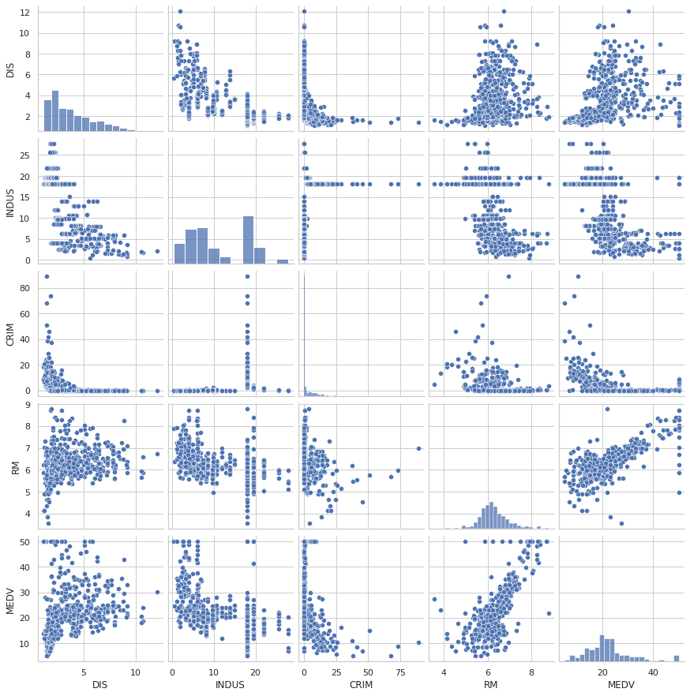
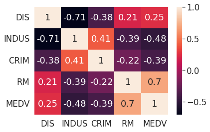
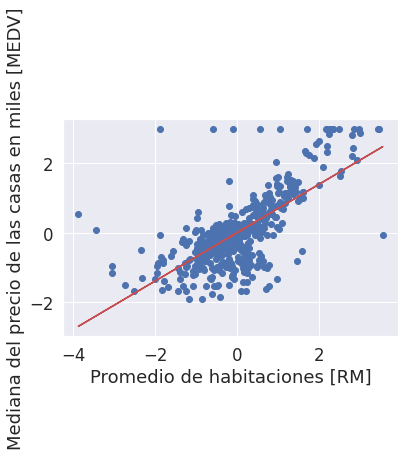
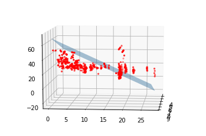

# Project Name

This project employs linear regression to predict Boston housing prices based on dataset analysis. It explores correlations, uses standardized data, and builds regression models. It provides insights into how features impact prices, aiding real estate analysis.

## Table of Contents

- [Introduction](#introduction)
- [Features](#features)
- [Process](#process)
  - [Importing Libraries and Loading the Dataset](#import)
  - [Understanding the Dataset and Visualizing Correlations](#understand)
  - [Simple Linear Regression (One-variable Prediction)](#simple)
  - [Simple Linear Regression Result](#simple_result)
  - [Multiple Linear Regression (Multi-variable Prediction](#multi)
  - [Multiple Linear Regression Result](#multi_result)

## [Introduction](#introduction)

This project utilizes machine learning techniques, specifically linear regression, to predict housing prices in Boston. It begins by analyzing the Boston Housing dataset, exploring relationships between various features and the median home value. The project then employs both simple and multiple linear regression models to make predictions. Simple linear regression focuses on a single predictor, while multiple linear regression considers multiple predictors. Through visualization and data standardization, the models provide insights into how features such as the average number of rooms per dwelling ('RM') and the proportion of non-retail business acres per town ('INDUS') affect housing prices. These predictive models assist in estimating property values based on specific input variables, aiding in real estate analysis and decision-making.

## [Features](#features)

1. CATH: per capita crime rate by town
2. ZN: proportion of residential land zoned for lots over 25,000 sq.ft.
3. INDUS: proportion of non-retail business acres per town
4. CHAS: Charles River dummy variable (= 1 if tract bounds river; 0 otherwise)
5. NOX: nitric oxides concentration (parts per 10 million)
6. RM: average number of rooms per dwelling
7. AGE: proportion of owner-occupied units built prior to 1940
8. DIS:   weighted distances to five Boston employment centres 
9. RAD: index of accessibility to radial highways
10. TAX:  full-value property-tax rate per $10, 000
11. PTRATIO: pupil-teacher ratio by town
12. B: 1000 (Bk - 0.63)^2 where Bk is the proportion of blacks by town
13. LSTAT: % lower status of the population
14. MEDV: Median value of owner-occupied homes in $1000's

## [Process](#process)

### [Importing Libraries and Loading the Dataset](#import)

In this step, we import the necessary Python libraries, including pandas, numpy, seaborn, matplotlib, and scikit-learn. We also load the housing dataset from a URL and assign meaningful column names to it using pandas.

```python
import pandas as pd
import numpy as np
import seaborn as sns
import matplotlib.pyplot as plt

from sklearn.preprocessing import StandardScaler
from sklearn.linear_model import LinearRegression
from mpl_toolkits.mplot3d import Axes3D
from mplot3d_dragger import Dragger3D


csv_path = 'https://archive.ics.uci.edu/ml/machine-learning-databases/housing/housing.data'
df = pd.read_csv(csv_path, header=None, sep='\s+')

df.columns = [
    'CRIM',
    'ZN',
    'INDUS',
    'CHAS',
    'NOX',
    'RM',
    'AGE',
    'DIS',
    'RAD'
    'TAX',
    'PTRATIO',
    'B',
    'LSTAT',
    'MEDV'
]
```

### [Understanding the Dataset and Visualizing Correlations](#understand)

This step involves visualizing the dataset and its correlations:

We use seaborn to create a pair plot to visualize relationships between selected variables. Then, we compute a correlation matrix to quantify the relationships between variables and visualize it as a heatmap.

```python
sns.set(style='whitegrid', context='notebook')
cols = ['DIS', 'INDUS', 'CRIM', 'RM', 'MEDV']
sns.pairplot(df[cols], height=2.5)
plt.show()
```



```python
correlation_matrix = np.corrcoef(df[cols].values.T)
sns.set(font_scale=1.5)
sns.heatmap(correlation_matrix, cbar=True, annot=True, yticklabels=cols, xticklabels=cols)
```



### [Simple Linear Regression (One-variable Prediction)](#simple)

In this step, we perform simple linear regression with 'RM' (average number of rooms per dwelling) as the predictor variable and 'MEDV' (median home price) as the target variable:

- We standardize both the predictor and target variables.
- We create a Linear Regression model, fit it to the standardized data, and plot the regression line along with the data points.

```python
X = df['RM'].values.reshape(-1, 1)
y = df['MEDV'].values.reshape(-1, 1)

# Standardize the data
sc_x = StandardScaler()
sc_y = StandardScaler()
X_std = sc_x.fit_transform(X)
y_std = sc_y.fit_transform(y)

# Create a Linear Regression model and fit it to the data
slr = LinearRegression()
slr.fit(X_std, y_std)

# Plot the regression line and data points
plt.scatter(X_std, y_std)
plt.plot(X_std, slr.predict(X_std), color='R')
plt.ylabel("Median home price [MEDV]")
plt.xlabel("Average number of rooms [RM]")
```


### [Simple Linear Regression Result](#simple_result)

Here, we make a price prediction for a 5-room house using the simple linear regression model and inverse transform the standardized prediction to obtain the price estimate.

```python
num_rooms = 5
num_rooms_std = sc_x.transform(np.array([num_rooms]).reshape(-1, 1))

print(f'A 5 room house in Boston costs ${sc_y.inverse_transform(slr.predict(num_rooms_std))} USD')
```

```python
A 5 room house in Boston costs $ 10.839 USD
```

### [Multiple Linear Regression (Multi-variable Prediction)](#multi)

In this step, we perform multiple linear regression with 'RM' and 'INDUS' as predictor variables and 'MEDV' as the target variable:

- We standardize both the predictor variables and the target variable.
- We create a Linear Regression model, fit it to the standardized data, and then visualize the prediction in a 3D plot.

```python
# Perform multiple linear regression with 'RM' and 'INDUS' as predictors
X = df[['RM', 'INDUS']].values
y = df['MEDV'].values.reshape(-1, 1)

# Standardize the data
sc_x = StandardScaler()
sc_y = StandardScaler()
X_std = sc_x.fit_transform(X)
y_std = sc_y.fit_transform(y)

# Create a Linear Regression model and fit it to the data
slr = LinearRegression()
slr.fit(X_std, y_std)

# Create a meshgrid for 3D visualization
x1_range = np.arange(df['RM'].min(), df['RM'].max())
x2_range = np.arange(df['INDUS'].min(), df['INDUS'].max())
X1, X2 = np.meshgrid(x1_range, x2_range)

# Predict MEDV for the meshgrid points
plane = pd.DataFrame({'RM': X1.ravel(), 'INDUS': X2.ravel()})
prediction = slr.predict(plane).reshape(X1.shape)
prediction = sc_y.inverse_transform(prediction)

# Create a 3D plot to visualize the prediction
fig = plt.figure()
ax = Axes3D(fig)
ax.plot_surface(X1, X2, prediction, alpha=0.4)
ax.scatter3D(df['RM'], df['INDUS'], df['MEDV'], color='R', marker='.')
ax.view_init(elev=10, azim=5)
dr = Dragger3D(ax, real_time=True)
plt.show()
```


### [Multiple Linear Regression Result](#multi_result)

Here, we make a price prediction for a 5-room house with a specific INDUS value using the multiple linear regression model and inverse transform the standardized prediction to obtain the price estimate.

In summary, this project involves loading and exploring a housing dataset, performing both simple and multiple linear regression, and making price predictions based on selected features.

```python
num_rooms_std = sc_x.transform(np.array([5.0, 8.0]).reshape(-1, 2))
price_std = slr.predict(num_rooms_std)
print(f'Price: ${sc_y.inverse_transform(price_std)} USD')
```

```python
Price: $ 10.840 USD
```
